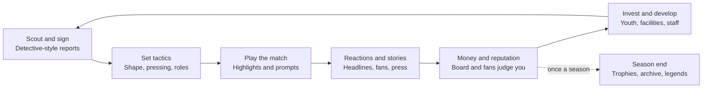

# Touchline — Game Design Document

Oct 3, 2026 · Source: [Claude Docs version](https://claude.ai/code/artifact/db0a1349-77d1-4363-b0df-55ef94250bd5)

## Contents

- [Vision and positioning](#vision-and-positioning)
- [Audience and business model](#audience-and-business-model)
- [Design pillars](#design-pillars)
- [Core gameplay loop](#core-gameplay-loop)
- [Match engine](#match-engine)
- [Tactical system](#tactical-system)
- [Players and personalities](#players-and-personalities)
- [Scouting and transfers](#scouting-and-transfers)
- [Youth development and university football](#youth-development-and-university-football)
- [Club identity, facilities and staff](#club-identity-facilities-and-staff)
- [Season preview and pre-season](#season-preview-and-pre-season)
- [Living world and football stories](#living-world-and-football-stories)
- [Career mode and manager identity](#career-mode-and-manager-identity)
- [Legacy and history](#legacy-and-history)
- [Global database and competitions](#global-database-and-competitions)
- [Historical eras and scenarios](#historical-eras-and-scenarios)
- [World editor and community sharing](#world-editor-and-community-sharing)
- [Mobile-first UX](#mobile-first-ux)
- [Monetisation and cosmetics](#monetisation-and-cosmetics)
- [Prototype status and roadmap](#prototype-status-and-roadmap)

## Vision and positioning

Touchline is a premium, mobile-only football management game that gives Football Manager players a proper long-term save on their phone without losing immersion.

**Tagline:** "The deepest football management experience built for mobile. Your club. Your stories. Your history."

**Positioning:** "The deepest football management experience built for mobile — not a watered-down PC port." It is the game people play when they can't sit at their PC but still want to lose themselves in a 40-year save.

**Elevator pitch:** A premium football management game built exclusively for mobile, combining Football Manager-level immersion with a modern touch-first interface, rich historical season databases from 1992 onward, and a living football archive that remembers every legend, rivalry and trophy your save creates.

**The core promise:** FM often feels like managing a database. Touchline should feel like living inside the football world, where media, fans, rivalries, personalities and history surround every decision. Losing a derby should immediately produce angry fan reactions, newspaper headlines, dressing-room conversations and social-media buzz.

**Why now:** FM Mobile is streamlined but limited: five active nations per save, a much smaller database than PC FM, and it is tied to a Netflix subscription rather than a premium purchase.

| FM frustration | Touchline's answer |
| --- | --- |
| Inbox overload | Story feed of visual cards |
| Long-term history is hidden | The Football Archive |
| Limited historical starts | Multiple historical eras |
| Mobile UI feels dated | Modern touch-first interface |
| Scouting feels formulaic | Detective-style scouting |

## Audience and business model

The audience is existing Football Manager players, not casual mobile players. They want FM-level depth on mobile at a lower price.

- **Primary:** FM veterans who play long saves and can't always be at a PC.
- **Secondary:** football fans who like building stories and sharing them on social media.

**Business model:** a one-time purchase of $9.99–$14.99, with regional pricing.

- No energy systems, no player packs, no pay-to-win.
- Free gameplay updates.
- Fully playable offline.
- Optional paid content: historical season DLC, database packs, cosmetics and extra save slots (see Monetisation).

## Design pillars

Every feature must serve at least one of five pillars. If it serves none, it is unnecessary complexity.

**Goal: feel like living in the football world, not managing a database.**

| Pillar | Meaning |
| --- | --- |
| Global | Every major footballing nation, tiered simulation |
| Club depth | Identity, fans, facilities, staff, finances |
| Living world | Clubs rise, fall, change hands; simulated, not scripted |
| Mobile-first | Swipeable, readable in seconds, quick matches |
| Stories | Emergent narratives, shareable cards |

**Foundation:** one-time purchase, offline, no pay-to-win, modular data model.

Personality and history matter more than ratings: a player is remembered as a cult hero who loves derbies, not as an 84 overall.

## Core gameplay loop

The loop is: play a match, earn money and reputation, scout players, develop youngsters, win trophies. Every result must feel consequential.

A matchday session should fit in a few minutes; a season is the medium-term arc; the save's history over decades is the long-term hook.

## Match engine

Matches are quick, visual and tactical: a top-down pitch of moving dots, a key highlight every 20–40 seconds, and tactical prompts at decisive moments.

**Presentation**

- Top-down 2D pitch with 22 moving dots and the ball.
- Visible pressing shapes: defensive and midfield lines drawn live.
- Highlights slow down and are announced with a banner; goals get a full-screen moment.
- Speed controls, pause, and an instant-result option for short sessions.

**Live analytics**

- Live xG per team.
- Tactical momentum bar, minute by minute.
- Passing networks and heat maps (post-match, and optionally live).

**Tactical prompts** appear when the match state calls for a decision. Examples:

- An analyst spots a slow full-back: target that flank?
- Behind with 30 minutes left: go direct and press high, stay patient, or make a change?
- Leading late: drop into a low block, keep the ball, or go for the kill?
- Pinned back for several minutes: switch to counter, press higher, or hold shape?
- A player is exhausted or injured: substitute or play on?
- Half-time team talk, where volatile personalities react differently.

Staff voice the prompts, and staff with strong personalities sometimes disagree with you.

**Session control:** pause, 1×/2×/4× speed, sim to half-time (stopping for the team talk), sim to end, or an instant result in which the assistant makes the substitutions.

**Post-match analysis** turns the match into evidence for the next decision:

- Analyst insights: whether the xG was fair, where chances came from, first half versus second, the effect of your first tactical change, who ran out of energy, pressing and territory. A better analyst says more.
- Shot map sized by xG, a cumulative xG race with goal markers, and a chance-type table for both sides.
- Player stats: minutes, passes, key passes, shots, possession won, end-of-match energy and rating.

**Pitch or text.** A match can be watched on a top-down pitch (players, ball and runs animated at 60 frames a second) or as text (a running commentary with the score, clock, xG, possession, momentum and every tactical prompt), chosen in Settings. Both views play the identical simulation: the view only decides how the scripted events look, and it draws its random numbers from a stream of its own, so a seeded match ends the same on the pitch and as text (checked on three seeds: the same score, xG, shots and events). What differs is the cost and the way it reads:

| | Pitch | Text |
| --- | --- | --- |
| Work per frame (desktop, 308 × 476 px canvas) | about 1 ms, 60 times a second | about 0.01 ms, four checks a second |
| Battery and heat | highest: the canvas is redrawn constantly | lowest |
| Length of a match at 1× | about two minutes | about one minute |
| What it shows well | shape, pressing, gaps, a run being made | every moment in words, with a scrollable history |
| Accessibility | needs a clear view of a small pitch | works with screen readers and large text |
| Best for | cup finals, derbies, learning how your shape plays | a long league run, a low battery, an older phone |

The instant result plays the same match with the assistant making the in-match decisions, and takes no time at all.

## Tactical system

The tactics offer enough depth for enthusiasts and no unnecessary complexity: four decisions plus roles, each with a visible effect on the pitch.

| Decision | Options |
| --- | --- |
| Build-up | Short passing, Direct, Counter, Possession |
| Pressing | High press, Mid block, Low block |
| Defensive shape | Back 3, Back 4, Back 5, inverted full-backs |
| Player roles | Segundo Volante, Carrilero, Mezzala, Inverted Winger, False 9, Libero, plus standard roles |

Every option must change both how the dots move and what the engine produces. For example, a high press wins the ball higher but tires players and leaves space for counters.

**Tactical familiarity** (0–100%) grows with every match and friendly in the same system and with a tactical camp. It gives a small performance edge, halves when you change formation, and drops back each summer.

## Players and personalities

Players are remembered for who they are, not their rating. Personality is what creates stories without scripted events.

**Visible data**

| Field | Notes |
| --- | --- |
| Key attributes | Pace, vision, dribbling, stamina and others |
| Rating | Stars, no overall number, measured against the league you manage in: three and a half is a typical starter there and five is among its best, so a Championship regular is two stars in the Premier League and four and a half in League Two. The rating behind it is a weighted mean of attributes whose weights per position are measured from the match engine rather than guessed |
| Potential | Shown as a range; certainty depends on scouting |
| Heritage | Where a player's family comes from when that differs from the nation he plays for (a Frenchman of Algerian descent), which shapes his name; shown on his profile |
| Morale | Driven by results, minutes, bids, team talks, press |
| Wage and contract | Negotiated; mercenaries demand more |
| Transfer value | Moves with age, form, potential and contract length |
| Form | Charts of recent ratings |

**Traits and hidden personality:** Big Game Player, Injury Prone, Late Bloomer, Loyal, Mercenary, Leader, Media Friendly, Temperamental, Derby Specialist, Fair-Weather, Consistent, Flair, and (round 10) Engine, Set-Piece Expert, Clutch, Aerial Threat, Hatchet Man, Slow Starter, Cup Specialist, Big-Match Nerves, Model Professional, Low Work Ethic, Versatile, Mentor, Homesick and Needs Game Time. A player has up to three, made from his attributes and hidden character; each has a real effect in matches, development, injuries or morale.

Personality quirks should read like real people. A player might be a cult hero who hates rainy matches, loves derbies, clashes with strict managers, and becomes captain after defending teammates.

A dressing room shouldn't be solved by ratings alone: leaders steady morale, volatile players react badly to harsh team talks, and ambitious players sulk when a move is blocked.

**Squad management:** renew contracts, transfer-list players, loan them out for minutes, or release them for a settlement of half their remaining wages. Released players join the free-agent pool.

## Scouting and transfers

Scouting is detective work: information is revealed gradually, in words rather than numbers, so discovering an undervalued player feels earned.

**Scouts have strengths.** A South America scout is excellent in Argentina and poor in Scandinavia. Better scouts uncover hidden information faster.

**Reports reveal information in stages** rather than all at once:

1. Headline verdict and statistical profile.
2. Strengths and weaknesses in plain language: "Excellent acceleration" instead of "Pace: 91".
3. Personality and injury history.
4. Hidden attributes and potential confidence.
5. Tactical fit against your current system.

**Transfer tools:** scout reports, heat maps, form charts, hidden attributes and analytics. The analytics department flags players whose output exceeds their price, which makes Moneyball signings genuinely rewarding.

**Market behaviour:** clubs value players by identity (selling clubs sell easily, oil-backed clubs ask a premium), players accept or refuse based on ambition and loyalty, and AI clubs bid for your stars.

**Assignments** cover a region or a whole league, filtered by position, maximum age, minimum potential and maximum fee, with a focus: best available, undervalued, wonderkids or ready now. Each scout reads potential with their own error, so two scouts can disagree.

**Grades and recommendations.** Every report carries an A–D grade, a recommendation (Sign, Loan, Monitor or Avoid) and a quote in the scout's own words. Scouts won't urge a signing far beyond the budget. Reports can be filtered by grade, position and age, and any target can be compared with your best player in that role on an overlaid radar.

**Negotiation detail.** Fees and wages use exact entry plus fine steppers (±$10K/$100K/$1M on fees, ±$50/$250/$1K on wages) and a contract length of 1–5 years. A good sporting director lowers the fees and wages you pay.

**Loans and free agents.** Loan players in by agreeing a wage share and an optional fee; loan your own players out to clubs that offer minutes. AI giants send youngsters out on development loans. Free agents can sign at any time for a signing-on bonus of ten weeks' wages.

## Youth development and university football

Watching a sixteen-year-old become a club legend is one of the strongest long-term hooks, so youth development gets first-class treatment.

**National development styles.** Different countries develop players differently:

| Nation | Produces |
| --- | --- |
| Japan | Disciplined technicians |
| Brazil | Flair players |
| Serbia | Tough defenders |
| France | Elite athletes |

**Academy facilities matter:** a better academy produces more and better prospects, and a better training ground develops them faster.

**Youth sides and B teams:** every full and light club runs U21 and U18 squads that play national youth leagues, so prospects outside the first-team squad still get games (which count a little toward their development). In Spain and Germany, B teams (Real Madrid Castilla, Barça Atlètic, VfB Stuttgart II, ...) play in the lower divisions as in real life: they can never go up into their parent's division, and their players belong to the parent, which pays them, sells them and moves them freely between the two.

**Training:** a weekly team focus (balanced, fitness, attacking, defending, technical, set pieces, tactics, recovery) and intensity (light, normal, hard), plus an individual focus or a new position for any player. Focus shapes which attributes grow; intensity trades faster development for more training knocks and heavier legs; set-piece and tactics work show up on matchday. The Analytics tab reads your season back to you (xG match by match, against the league, chance types, when goals come), and a better analyst sees more in it.

**University and alternative pathways** add further sources of talent:

- University draft.
- High school graduates.
- Scholarship players.
- Overseas trials.

## Club identity, facilities and staff

No club is generic: each has an identity that sets board objectives, fan expectations and how the club behaves in the market.

**Identity archetypes:** youth-focused, selling club, fallen giant, oil-backed, fan-owned, historic rival.

**Fan culture.** Each club has supporter expectations, board politics and historical legends. Managing Dortmund should feel culturally different from managing Boca or Brighton.

| Club (example) | Fans expect |
| --- | --- |
| Brighton | Youth development |
| Real Madrid | Trophies |
| Dortmund | Attacking football |
| Boca Juniors | Derby wins |

Board objectives reflect that culture, not just a league position.

**Facilities** are upgraded over decades and become part of your legacy: training ground, youth academy, medical centre, analytics department, stadium, fan zone and club museum.

**Staff have personalities too.** The assistant manager, coaches, scouts, analysts, medical staff and sporting director each have views, and some disagree with your decisions.

**Staff market.** Hire and fire an assistant manager, first-team coach, head of analytics, head physio, sporting director and up to five scouts. The market refreshes each season. Hiring costs four weeks' wages up front; firing costs compensation, and a vacant role is covered by a weak caretaker.

| Role | Effect |
| --- | --- |
| Assistant manager | Notices more in the squad notes; predicts the season more accurately |
| First-team coach | Faster player development |
| Head of analytics | Deeper post-match insights; Moneyball flags |
| Head physio | Shorter injuries |
| Sporting director | Lower fees and wages when buying |
| Scouts | Regional knowledge and judgement of ability and potential |

**Assistant's notes.** The squad screen opens with the assistant's observations and one-tap fixes: players out of position (with a better natural to swap in), low fitness, in-form players on the bench, unhappy players, youngsters ready for the first team or a loan, the weakest area to scout, expiring contracts and expensive players who barely play.

## Season preview and pre-season

Every season opens with a preview and three pre-season days before matchday 1.

- **Season preview:** the assistant's predicted table and your predicted finish, bookmaker title odds, the pre-season best XI, the key man and one to watch, board expectations and summer signings.
- **Friendlies:** home games earn gate money and away games an appearance fee; stronger opponents test the squad harder. Friendlies raise tactical familiarity but don't count towards player stats.
- **Camps:** fitness (everyone starts at 100%), tactical (a big familiarity boost), youth (extra development for players aged 21 and under), or a commercial tour of Asia (earns money and fans but tires the squad).

## Living world and football stories

The world keeps moving whether you're involved or not, and it is simulated rather than scripted. Every save should feel like following football media, not reading emails.

**World events**

- Managers get sacked; owners buy and sell clubs; clubs go bankrupt.
- Wonderkids emerge; rivalries evolve; new stadiums are built.
- Rule changes, league expansions and sponsorship deals happen.
- Over decades clubs rise, owners sell, leagues expand, financial crises hit and new rivalries form.

**The story feed** replaces the inbox. Opening the app shows breaking transfer rumours, fan reactions, press conferences, club podcasts, rival supporters arguing and newspaper headlines. Example headlines:

- "Teen striker compared to Haaland."
- "Veteran captain refuses transfer."
- "Fans protest owner's decision."

**Consequences are immediate.** Losing a derby produces angry fan reactions, headlines, dressing-room conversations and social-media buzz straight away.

**Shareable story cards.** Notable moments become Instagram-style cards with slick graphics, exportable to social media, so players build their own narratives rather than chase ratings:

- "19-year-old Thai winger scores on debut."
- "Singapore club shocks Urawa in the AFC Champions League."
- "Veteran captain retires after 600 games."

## Career mode and manager identity

You aren't just clicking buttons: your reputation and identity develop from how you manage, and they shape job offers and how players see you.

**Earned over a career:** reputation, coaching badges, a preferred tactical style, and relationships.

**Identity tags** emerge from behaviour: Tactical Innovator, Youth Developer, Giant Killer, Promotion Specialist.

**Long-term goals:** national team jobs, returning to former clubs, and becoming a legendary manager.

## Legacy and history

Every save creates its own history, and the game remembers it. Clubs develop traditions because of your save, not just because of real history.

**Club memory.** Manage Brighton for 35 years and the game remembers Glenn Murray's farewell, Lewis Dunk's statue, your greatest comeback, the academy kid who became captain and famous derby wins.

**Hall of Fame** per club: top scorers, most appearances, cult heroes, biggest sales and academy graduates.

**Football Archive.** Every save builds its own encyclopedia: every league winner, every Ballon d'Or, the biggest transfers, the greatest managers, club legends and famous upsets. Fifty seasons later you can scroll through decades of alternate football history like Wikipedia.

**Legacy save.** Retired players don't disappear. They become managers, sporting directors, club owners, pundits and academy coaches.

## Global database and competitions

Every major footballing nation is represented, but simulation depth is tiered rather than launching hundreds of fully simulated leagues at once.

| Tier | Scope | Depth |
| --- | --- | --- |
| Full simulation | Top 30–42 leagues | Full match engine, finances, transfers |
| Light simulation | Smaller leagues | Every fixture played by a statistical model from team strength; per-match goals, assists, cards and ratings for real players; clubs buy and sell |
| Minimal simulation | Rest of the world | Scores from reputation; squads and players exist for scouting and the market |

In the prototype, continental and Club World Cup ties always use the full engine, whatever tier a club plays in.

**Continental competitions:** UEFA Champions League, Europa League, Conference League, Copa Libertadores, AFC Champions League Elite, CAF Champions League, CONCACAF Champions Cup and the Club World Cup.

**Modular structure.** The game never hardcodes "Premier League, then Championship, then League One". It models competitions and the rules between them: Competition A has a promotion/relegation relationship with Competition B, and Competition X has a qualification rule into Competition Y. The editor then restructures football by changing those relationships.

**Realistic nationalities.** Each league draws players from its own nationality mix: the English top flight is about 38% English with French, Portuguese, Spanish, Brazilian, Dutch and African players; the second tier is about 60% English with many Irish, Scots and Welsh; the Spanish top flight is about 60% Spanish with many Argentines, Brazilians and French. Academies follow their own mixes, and 35 nations each have their own naming and development style.

## Historical eras and scenarios

Saves can start in historical seasons from different eras, with rules and tactics appropriate to the time. Databases run from 1992 onward.

**Modes**

- **Historical mode:** the world starts as it was and changes realistically from there.
- **Sandbox mode:** dynamic alternate history, where the world diverges freely.
- **Historical scenario challenges:** set objectives inside a specific era.

**Alternate history before kick-off.** Players can change the world before starting a save, then hit start and let the football universe evolve. Example set-up from 1995:

- The Bosman ruling never happens.
- The Premier League has 20 teams instead of 22.
- The Champions League remains a knockout tournament.
- Japan establishes a second division earlier.
- MLS launches with promotion and relegation.
- Yugoslavia remains intact; the Soviet Union doesn't dissolve.
- A fictional club replaces an existing one.
- Brazil adopts European-style promotion and relegation.

**Scenario creator** (its own mode). Players package changes as shareable scenarios:

| Scenario | Start | Key changes |
| --- | --- | --- |
| The European Super League | 2000 | 20 founding clubs, closed competition, massive TV revenue, UEFA responds with new competitions |
| Japan Becomes Asia's Superpower | — | Big J.League investment, easier ASEAN registration, changed AFC structure |
| Singapore 2040 | 2040 | 16-team league, 3 professional divisions, stadium investment, AFC powerhouse |

## World editor and community sharing

The editor turns the game into a football-management sandbox: players can restructure football itself, not just edit a player's ability. It only works because the underlying model is modular (see Global database).

| Layer | What players can change |
| --- | --- |
| Competitions | New leagues, divisions, league size, promotion/relegation, playoffs, split leagues, points systems, domestic cups, super cups, continental competitions, qualification, foreign-player slots, squad registration |
| Clubs | Create, rename, colours, stadium, city, rivalries, reputation, finances, facilities, competition membership, move country, merge, dissolve, relocate |
| Nations | Professional divisions, foreign-player and work-permit rules, youth eligibility, registration, cup structure, national team competitions, coefficients, continental places, transfer regulations; create fictional nations |
| Players | Name, age, nationality, position, attributes, foot, personality, contract, wage, value, injury history, potential, club, squad status; create players and fictional generations |
| Staff | Managers, assistants, coaches, scouts, sporting directors, analysts, physios, doctors |
| Rules | Match (extra time, penalties, subs, squad and bench size, VAR); transfers (windows, loans, foreign and homegrown rules, contracts, free agents); finance (salary caps, luxury tax, FFP, squad cost limits, spending limits); competition (points, tiebreaks, playoffs, groups, knockouts, seeding, coefficients) |
| History | Start date and historical events |
| World | Entirely fictional football structures |

Examples: a fictional 18-team "Southeast Asian Super League" with four continental places; a fictional "Republic of Albion" with 3 divisions, 20 clubs in Division 1, 4 relegated, 5 foreign players and 2 continental spots; "What if the Premier League had a salary cap?"

The ambitious end state is a Football Universe Editor: start in 1900 with different rules, fictional clubs and new competitions, and play to 2100.

**Community sharing** works like a Steam Workshop for mobile:

- Databases: 1998, 2005, a fictional 2035.
- Leagues: the Singapore pyramid, Malaysian lower leagues, fictional African leagues, alternate European leagues.
- Scenarios: Super League, 1990s alternate history, a modern financial crisis, a fictional World Cup.
- Graphics: kits, logos, competition branding, stadiums.

## Mobile-first UX

Mobile is where FM is weakest, so the goal is less reading and more feeling. Every screen should be swipeable, visually rich, animated and readable in seconds, and satisfying to interact with.

| Instead of | Use |
| --- | --- |
| Giant attribute tables | Player cards and radar charts |
| Match text feeds | Momentum bars and live graphics |
| Static stat pages | Interactive heat maps |
| The inbox | Story feed, headlines and fan reactions |

The UI ships with dark and light themes.

## Monetisation and cosmetics

Revenue comes from the upfront purchase and optional content that never affects results. Nothing sold can make a team stronger.

| Offer | Type |
| --- | --- |
| Base game, $9.99–$14.99 | One-time purchase, regional pricing |
| Historical season and database packs | Optional DLC |
| Cosmetic stadium themes | Cosmetic |
| Retro kits | Cosmetic |
| Extra save slots | Convenience |

Gameplay updates are free.

## Prototype status and roadmap

Four prototype builds, Alpha 1, the polish and small-features backlogs, mobile readiness step 2 and playtest feedback batches 1–6 are done: 746 fictional clubs in 42 leagues (the real structure under invented names) across 32 nations in three simulation tiers, B teams and U21/U18 sides, 18 domestic cups, 14 continental cups (including the Europa League, Conference League and Copa Sudamericana) and a Club World Cup, international football with 91 national teams, contract clauses and agents, player promises, board meetings, club records and rivalries that grow, and an installable app with save upgrades and backups.

The full breakdown lives in [FEATURES.md](FEATURES.md), the phased plan in [ROADMAP.md](ROADMAP.md) and each competition's real rules in [COMPETITION_RULES.md](COMPETITION_RULES.md).

| Area | In the prototype | Yet to be added |
| --- | --- | --- |
| Match engine | Dots with a moving back line, marking, jockeying and early runs; highlights, prompts, live xG, momentum, sim to half-time, instant result; captain's armband, set-piece takers, pre-match and half-time team talks, warm-ups; weather, home advantage, club confidence | Live passing network and heat map during play |
| Post-match | Insights, shot map, xG race, chance types, set-piece goals, player stats, ratings, shape | — |
| Tactics | 12 formations, build-up, pressing, width, inverted full-backs, roles with engine effects, Plan A and Plan B, familiarity, positions by side and learned positions | Tactical evolution driven by successful managers |
| Players | Attributes, potential, morale, traits, personality, renew/list/release, contract clauses, agents, talks and promises, transfer fees on the career timeline, injury history, Player of the Month | Relationships; career biographies |
| Scouting and transfers | Regional scouts, league/region assignments, A–D grades, compare, fine negotiation, loans, free agents, international market, club and world transfer records | Agents as characters |
| Youth and training | Nation-shaped intakes, facility and coach-driven development; U21 and U18 sides with youth leagues; B teams in Spain and Germany; training focus, intensity and individual training | University draft, scholarships, overseas trials; national youth pathways |
| Club | Identities, fan culture, facilities, finances by country, attendance, wage pressure up to administration, staff whose ability has real effects, assistant notes, board meetings and ultimatums, club records, stadium history; analytics of your season | Club philosophy, deeper staff, deeper economics |
| Season | Preview, pre-season friendlies and camps, weekly matchday digest | — |
| Competitions | 48 leagues in 38 nations across full, light and minimal tiers (your league and its neighbours always full); 5 domestic cups; 7 continental cups (incl. Europa League and Copa Sudamericana) and a Club World Cup; playoffs; two-legged ties with optional away goals | A third-tier continental cup (Conference style); more nations |
| World and stories | 35 nations, living world, story feed, shareable cards, World News filters, rivalries that emerge and cool, managers who move between clubs, record-breaking news | Podcasts and richer press; historical eras; scenarios; Football World screen |
| Legacy and career | Hall of Fame, Archive, legends as managers, reputation, job offers, start unemployed or play on after a sacking, coaching licences, national team jobs, all-time head-to-heads, team-talk record | Retired players as owners and pundits |
| Platform | Installable offline web app, save upgrades, compressed backups, background simulation, native-app projects (Android, iOS) | Device builds, cloud saves |
| Editor | Every career plays by each competition's real rules | Full database and rules editor; database export/import and community sharing |

**Decision:** the game ships with fictional leagues, clubs and competitions, keeping the real structure, sizes, formats and rules; real names become optional packs. The prototype now runs on the fictional set (generated names over the real structure; the real names are kept in data/real-world.json for optional packs) and fictional players.
