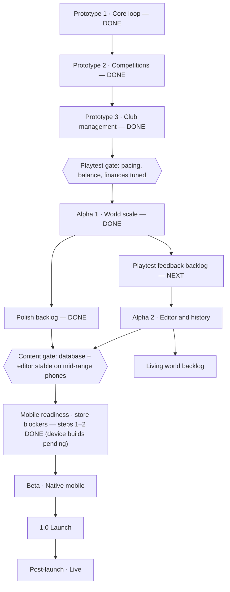

# Touchline — Roadmap

Oct 3, 2026 · Source: [Claude Docs version](https://claude.ai/code/artifact/4208fb1b-f42b-4a90-86c7-46c970e08ba9)

## At a glance

Four prototype builds, Alpha 1, the polish and small-features backlogs and mobile readiness step 2 are done, and so are playtest feedback batches 1–6 (bugs, interface, speed, realism, transfer market, tactics and match engine, big features), including a second round of feedback folded into batches 2, 4 and 6. Rounds 3–6 add items to batches 1, 5 and 7 (marked by round); batch 7 (platform) is next, with a round 8 of ideas from comparative review merged in (batch 8 below), then Alpha 2 (editor and history) and a living-world backlog; device builds and a native store release follow. Phases are ordered but not yet dated.

## Shipped

The web prototype runs on a phone browser with no build step, covering 710 real clubs in 40 real leagues across 31 nations in three simulation tiers, and 85 national teams. Newest build first.

| Build | What shipped |
| --- | --- |
| Playtest feedback, round 10 | Club abbreviations come from each club's own name (no more CHE3 or CON for clubs that were renamed), names are filtered for rude words in every language the library writes in, England's divisions are ENG1–ENG4 instead of D1–D4. The pre-match win chance now moves with the crowd, derbies and confidence and no longer sits on a floor; a release clause is announced a day before it is paid; fans are angry when a talented teenager goes cheap. Danger man is an attacker, the assistant compares youngsters with their own position, a player's season table adds the earlier seasons the Career panel counts, "Born Leader" no longer repeats the Leader trait, plural and spacing slips, shorter club names in the match header, squad numbers best-first, and Vietnam, Indonesia, Malaysia and the Philippines join the world. |
| Playtest feedback, round 9 | Your world screen shows the rules of the league you picked (format, tiebreakers, promotion and relegation, continental places, cups, squad and foreign-player rules). Bigger name pools, a few hundred names per culture, and a family heritage for each player (a Frenchman of Algerian descent has a Maghrebi first name), shown on the profile. Star ratings instead of overall numbers, measured against the league you manage in: a Championship regular is two stars in the Premier League and four and a half in League Two. Real work-permit rules: the Governing Body Endorsement for England, Scotland and Wales (automatic by share of national-team games and ranking band, otherwise 15 points), Germany's eight locally trained players, and Cotonou and Euro-Med players counting as EU in Spain and France. A text-only match view that plays exactly the same match as the pitch, compared with it in the design document. Forty-three more nationalities (81 in all, each with its own national team where it has enough players and a name culture of its own), so squads look like a real world. Season-by-season now includes the current season, a line per club for a mid-season move. A goalkeeper's international record shows clean sheets instead of goals. Before the save starts you can choose which leagues are simulated in full, lightly or minimally (your league and its neighbours are always full), with a load estimate. The tagline: The deepest football management experience built for mobile. Your club. Your stories. Your history. Squad numbers for every player (a keeper 1, a striker 9; kept when free at a new club), on rows, profiles and line-ups; every player named in a scout report is tappable. Platform batch: text size, screen-reader labels, higher-contrast text, a first-time tutorial, a local error log in problem reports, and five save slots. Regional competitions: 14 English county cups (knockouts among each area's clubs from all four divisions; the big clubs field reserve sides) and 5 Brazilian state championships (a league phase then a final; the small states play together), each on its own early-season days. Ratings: stars are measured against the regular starters of the league you manage in, at the player's own end of the pitch (keepers against keepers, defenders, midfielders, attackers), with the size of a star set by that league's own spread; the old single scale made a typical striker look a full star worse than a typical keeper. On profiles the attributes a position asks for are in bold and the ones it does not use are dimmed. Ability: the weights behind a position's rating are measured from the match engine (goal difference regressed on every attribute over 150,000 simulated matches), explaining 21% more of a result than the hand-made table, with a constant per position keeping ratings and values on the old scale; older saves are re-rated on load. |
| Playtest feedback, round 8 | Comparative-review feedback. A training ground that caps development (a player who has outgrown it develops slowly until it is upgraded). Position percentiles on scouting cards, a contract cost table in talks, and a backfilled player history for new worlds. Real-life club abbreviations and nicknames, and overall shown at the slot and per position. A "What's new" list in Settings, built from this table. A Positions card on the player profile and an Other positions switch on the squad list. A standout stat in words on squad and shortlist rows. A Press room with five outlets that report on your club in their own voices, and a switch for your club's colours as the accent. Developer tools (left out of public builds) and a wonderkid test: over 10 seasons 8/8 measures in range. Calibration 49/50. |
| Playtest feedback, round 7 | Four more leagues (A-League Men, Hungarian NB I, League of Ireland Premier Division, Cymru Premier; two new nations; the Serbian SuperLiga was already in). Wide midfielders (LM/RM) with their own roles and the flat-four flanks. Position versatility (second positions from neighbouring positions, utility players, faster learning for the young, natural positions that change with age) and better selection (swap-improved XIs for every club, bench cover by who can play where). Transfers closer to real life (free transfers about a fifth of the market, home-first buying for small clubs, selling leagues and clubs, blockbusters between giants, veterans to MLS). A coefficient ranking instead of Elo. An evenly spaced bottom bar. Six more domestic cups (Coppa Italia, Taça de Portugal, KNVB Cup, Copa Argentina, U.S. Open Cup, Emperor's Cup) and three more continental cups (Conference League, AFC Champions League Two, CAF Confederation Cup). Real rules per competition ([COMPETITION_RULES.md](COMPETITION_RULES.md)): each league's tiebreakers, two-legged and neutral-ground cup rounds, centralised AFC knockouts, two-legged CAF and CONCACAF finals, two-legged play-off finals in Spain and Italy, German relegation play-offs, no away goals. A bug sweep (pre-contracts against squad limits, keepers after rollover, double sales, a league table crash). Real-life club abbreviations and nicknames. Player overall shown at the slot and at each position he can play. Profile card comparing a player's stats with his position in his league, a cost-by-season table in contract talks, and three seasons of backfilled history for every player of a new world. |
| Playtest feedback, batch 6 | Big features. Training (team focus and intensity, individual focus or a new position) and analytics (your season in xG, against the league, chance types, goal times, the analyst's notes). Staff abilities with real, listed effects. Press conferences, journalist questions, warm-ups and half-time options. Player stats view, keeper numbers (saves, save %, clean sheets, goals prevented), season-by-season history kept forever, club seasons and league leaderboards. Money by country (TV in England, gates in Germany, sales in Brazil and Portugal), attendance that reacts, wage pressure up to administration. UEFA Europa League and Copa Sudamericana. Six more divisions (League Two, Primera Federación, 2. and 3. Liga, Serie B, Ligue 2): 664 clubs in 36 leagues. B teams (Castilla, Barça Atlètic, Stuttgart II, ...) that can never go up to their parent's division, with the parent's players; U21 and U18 sides and youth leagues. Follow clubs, competitions, nations and players. More natural match movement (a back line, marking, jockeying, early runs, spacing). Groundwork for saves that start in a past season. The new divisions run in the light simulation (full when they're your league or next to it). Calibration 52/53 and 53/53 on two seeds (elite growth eased to keep the world's best from inflating; the one miss is a borderline goals trend of −0.022 a season). |
| Playtest feedback, round 2 (batches 2 and 4) | International tab. Scouting filters (position, age, level against your XI, fee, wage, contract, nationality, league, availability), judged on your scouts' estimates. Transfer fees in green (in) and red (out), and every transfer history links to the player. Deadline day hour by hour: a live ticker of deals, late bids and collapses until 23:00. Pre-contracts from the mid-season window, for you and AI clubs (yours get a warning first). Players running down their contracts sell cheaper. Fan and board reactions to your transfers. Full negotiation of bids for your players (fee, instalments, add-on, sell-on). Loan offers for your players, some with an option to buy. Loan suggestions that name where he'd play. Scouting reveals more, rung by rung (foot and second positions, best role, situation, mentality, wage demands, agent). Calibration 51/51 on both seeds. |
| Playtest feedback, batch 5 | Tactics depth. Plan A and Plan B, each with its own familiarity, switchable mid-match. Six more formations, a width instruction and a Wing Play build-up. Roles that decide who shoots, creates, wins headers and wins the ball back, plus ten new roles. Positions by side (the stronger foot matters on the flanks), second positions and learning new ones. Keeper howlers and big-game stars. Home advantage that varies with the crowd, stadium, derbies and travel. Weather by climate and season (rain, snow, heat). Club confidence from recent results. A calibrated amount of upset. Calibration 51/51 and 50/51 on two seeds (two new measures: underdog wins, keeper errors); title races more open (top-three champions 83–87%). |
| Playtest feedback, batch 4 | Transfer market depth. A deadline with a countdown, a warning three days out, deadline day (more AI buyers at a premium, late bids, the skip stops for it) and a window summary. Trials for free agents. A loan watch for loanees who aren't played (recall them, or tell the club to play them). Fee talks that go back and forth (clubs counter down to a floor, agents make their own proposals, you can counter bids for your players). A relative market (players who want away and clubs in debt sell cheaper; clubs short at a position pay more). Players choosing between clubs and saying why. Fees in instalments, add-ons and sell-on clauses, with payments to come in the finances. AI clubs replacing ageing starters. Each real league's foreign-player rules (homegrown quotas, non-EU limits, MLS international slots, foreign caps) for new careers. Calibration 48/49 and 47/49 on two seeds; over-30s' share of top-flight minutes now ends six seasons at 25% (was 27–30%). |
| Playtest feedback, batches 1–3 | Three playtest reports worked through. Bugs (undefined nationalities, offers for your own loanees, captaincy switching, replaying lost matches), interface (feed of your club, needs-reply list, daily transfer round-up, tap any badge for the club, club picker search, money in the club's currency, readable crests), speed (pre-season days ~8× faster), realism (settled players after a move, fans judged against expectations, transfer-window rules, no foreign-player limit by default, auto pick with roles, market value by league and club, deeper squads, club icons and testimonials). Calibration now 48/49 measures in range on two seeds: title dominance, elite inflation, injuries and retirement ages fixed. |
| Code cleanup | No gameplay change, proven by identical seeded test and calibration results. Removed dead code, merged duplicate name pools and the test tools' copied loaders (`tools/harness.mjs`), split the three largest files (clubs into `clubs.js`, player development and retirement into `careers.js`, the transfer market into `transfers.js`). ESLint and Prettier added (`npm run lint`, `npm run format`); every deploy now has to pass both before it goes live. |
| World expansion and dynamic tiers | Your league, the one above and the one below always play in the full engine: relegated from the Premier League, League One switches from light to full; out of work, every league returns to its own tier. Ten more leagues in minimal simulation, in UEFA coefficient order: Belgium, Turkey, Czechia, Greece, Norway, Poland, Denmark, Austria, Switzerland and Scotland (146 real clubs, 19 derbies such as the Old Firm and the Kıtalararası Derbi), with six new nations (Turkey, Czechia, Greece, Poland, Austria, Switzerland) and national teams. Name pools at least doubled for most nations (every nation 40+ first names and 43+ surnames), with more real-player combinations blocked. The world is now 547 clubs in 30 leagues, about 10,600 players and 35 national teams |
| Manager profile and lighter lower leagues | New careers start with a full manager profile: first and last name, country (your own national team is more likely to offer you a job and will take a chance on a lower reputation), favourite club (managing them is a homecoming with warmer fans and a more patient board; managing their rival starts frostier; their job offers come more often and their trophies, promotions and relegations reach your feed) and an avatar (24 faces, 8 colours) shown on the manager card and out-of-work header. League One and the Segunda División now use the light simulation: clubs take their league's tier on promotion and relegation, the club you manage is always fully simulated, and both still play in the FA Cup and Copa del Rey |
| Real leagues | Real league and competition names (Premier League, LaLiga, Bundesliga, UEFA Champions League, Copa Libertadores, FA Cup, FIFA World Cup, ...) and real league sizes: 401 clubs in 20 leagues (Premier League 20, Championship 24, League One 24, LaLiga 20, Segunda 22, Bundesliga 18, MLS 30 playing 34 games, Argentina 28 playing a single round-robin, ...) with real kit colours and 106 derbies. The season has 46 league days: every league spreads its own rounds across them so all finish together; cups, European nights and international breaks are placed by share of the season, and the FA Cup has enough rounds for 68 clubs. Rates retuned for real-length seasons and a world twice the size (injuries per match, AI market quotas). Cost: saves ~6 MB and simulation ~1.8× slower per day |
| Real clubs and free agents | Real club names across all 20 leagues (207 clubs with real colours, cities and stadiums, and 63 real derbies such as the Manchester Derby, El Clásico and the Superclásico), keeping the game's own ratings, league names and fictional players. Free agents are mostly lower-league standard: the unattached players the world creates now centre on ability 47, with only about 3% good enough for a top flight; free agents of top-flight quality are ~0.1% of the pool (new calibration measure) |
| Careers and market pass | Hostable on GitHub Pages (a workflow builds and publishes on every push). Hidden career arcs: wonderkids who flop (stall, plateau well short of their potential, or peak at 22–25 and fall away fast), one-season wonders (a sudden big year, given back within two), early primes at their best by 18–19 (Mbappé, Yamal) and long primes still at their best at 33–34 (Messi, Ronaldo); `npm run test:regens` checks the career shapes. A realistic market: a loan market (young players with room to grow and fringe seniors go where they'll start; ~1.4 top-flight loans out per club, loanees ~13 games), free agents who sign any day to fill real gaps and lower their sights the longer they wait (median ~3 weeks), winter contract cancellations for unused veterans, and no more players conjured each summer (full clubs carry three keepers); calibration adds four market measures |
| Steady scoring pass | Fixed goals per match creeping from ~2.6 to ~3.0 over 10 seasons; now flat (trend −0.01 to 0.00 a season, every season 2.6–2.9). Two root causes: players who developed in the simulation barely grew their secondary attributes, so defending eroded as academy products replaced generated players; and new managers picked tactics at random instead of the usual mix, drifting the world toward open shapes. Plus tactical equilibrium: if the whole game drifts, the chance rate eases back toward the calibrated level each summer (capped ±15%, never changing differences between teams). Academy and generated-player potential retuned so each generation's elite is closer to the last (elite growth down from +0.5 to about +0.3 ability a season). Calibration adds goals-trend, elite-trend and player-shape measures |
| Squad turnover pass | Fixed the long-save drift toward ageing top-flight squads (over-30s' share of minutes climbed from 22% to 32–35% over 8–10 seasons; now steady at 22–28%). Top-flight clubs were making ~0.1 signings a season because full squads blocked buying; AI clubs now upgrade their weakest starting spot, judge ageing players on where they're heading, buy from smaller clubs or peers (never a direct domestic rival), sell the displaced player down the pyramid to fund the next deal, and renew veterans more strictly. ~3 top-flight signings per club-season; title races stay open (pre-season top-3 clubs win 73–88% of titles, real 70–90%) |
| Careers and injuries pass | Player careers and injuries measured against real football (`npm run calibrate` now reports 41 measures). Career shapes: fast growth in the teens, a peak around 27–29, decline through the thirties (pace first, reading of the game last), keepers and centre-backs ageing later, a personal ageing clock per player, veterans on one-year deals and retirement at ~33–35 depending on form and injuries, a new world generated with a realistic age profile. Injuries: 23 real types from hamstring strains to ACL ruptures, ~35 a club-season with ~9% of a squad out, risk from proneness, age, fatigue and a recent return, training knocks and illness, re-injuries, long layoffs costing development and sometimes pace; for your players, medical news, surgery-or-rehab decisions and "risk him?" before big games |
| Calibration pass | Match engine tuned to real top-flight numbers with a calibration report (`npm run calibrate`): 19–20 of 20 measures in range over six-season runs, goals steady at ~2.7 a match instead of creeping up; home advantage, game state, booked-player caution, realistic cards and penalties |
| Long-term pass | Start unemployed, a real out-of-work state after a sacking (offers come and go while the world plays on), squad safety net, fixes for tournament and save/load bugs found by 4–16-season simulations, leaner long saves (format v6), staff ageing and retirement, rarer wonderkids, every club keeps enough goalkeepers (outfielders were ending up in goal and goals per game crept up) |
| Small features (moderate) | World News filter chips, managers who move between clubs (poached, rehired or new) with tracked careers, stadium opening years and capacity histories with expansion stories |
| Small features (easy) | Club records and record-breaking news (club, all-time, world transfer), all-time head-to-heads, rivalries that emerge from knockouts and red cards, Player of the Month, injury histories with recurring-problem warnings |
| Small features | Transfer fees on career timelines, captain badge in squad lists and live matches, set-piece goals after the match, in-form and out-of-form players in the digest, team-talk record, last-backup date and season-end backup reminder |
| Mobile readiness 2 | Save migrations (format v5, original kept), saves as real files in the native app, compressed backup export/import, matchday simulation in a Web Worker with progress, autosave when backgrounded, back button / safe areas / keyboard / portrait lock / tablet layout, native haptics, share sheet and status bar, production build and headless regression test, Capacitor 8 Android and iOS projects |
| Alpha 1 polish | Harder polish batch: captain choice (armband boost, Leader effects, morale reactions), pre-match team talk, weekly matchday digest in the feed, penalty / free-kick / corner takers in the match engine. Moderate polish batch: wage and bonus breakdown, negotiation memory, feed read state and Clear read, clean pitch labels, clinched/eliminated group markers. Easy polish batch: restore dismissed reports, compare from report rows, rating-change arrows, stats across all leagues, head-to-head and full fixtures on the team overview, window alerts when skipping. Very easy polish batch: season-preview and haptics toggles, haptic taps, full names and release clauses on scouting rows, opponent's last result on the match card, auto-pick names who it rested, "level on aggregate" extra-time banner. Earlier: match fitness indicators and fitness-aware auto-pick; rating numbers, sort and filters on the squad list; contract-end tags, expiry reminders and no automatic renewals; formation changes keep familiarity; before-kick-off reminders; team overview from any table; Home icon jumps to decisions; dismissable scout reports; compact saves (~3 MB); installable, offline web app (mobile readiness step 1) |
| Alpha 1 · World scale | 12 more leagues in light (Italy, Portugal, Netherlands, Argentina, USA, Japan) and minimal (Mexico, Korea, Thailand, Nigeria, Morocco, Serbia) simulation tiers; Asian, African and North American champions cups and a mid-season Club World Cup; two-legged knockouts and playoff semi-finals with an optional away-goals rule; international qualifying groups, double-header breaks, summer finals as live calendar days, national team jobs; contract clauses (squad status, signing-on fee, appearance and goal bonuses, release clauses, yearly rise, relegation cut) and agent personalities; player talks, promises and player-requested meetings; board meetings, mid-season review and ultimatums; coaching licences; "Next match" skip; world simulation roughly 3× faster |
| Prototype 4 · World expansion | 8 leagues in 5 nations (England 3 tiers, Spain 2, Germany, France, Brazil), domestic cups in every nation, 16-club European cup with quarter-finals, Copa Continental (South America), international football (national teams, Elo ranking, breaks, World and continental championships, caps), fluid match motion, unique player names, fairer board model, finance and development rebalance, IndexedDB saves |
| Prototype 3 · Club management | Staff hire/fire with ability effects, assistant notes and scout picks, season preview with odds and best XI, pre-season friendlies and camps, tactical familiarity, loans in/out, free agents any time, graded scout reports with filters and comparison, fine-grained fee/wage negotiation, realistic nationality mixes (28 nations), post-match shot map, xG race, player stats and analyst insights, sim to half-time, random club at new game |
| Prototype 2 · Competitions | La Primera (Spain, 12 clubs), Crown Cup and Copa Nacional knockouts, Continental Champions Cup (groups + knockouts) with data-driven qualification, cross-border AI market, Transfer Centre |
| Prototype 1 · Core loop | Top-down match engine with highlights and tactical prompts, two-division England with promotion, relegation and playoffs, player traits and personality, word-based scouting, youth intakes, story feed and shareable cards, living world events, Hall of Fame, Football Archive, dark/light theme, 3 save slots |

## Next

The order below is proposed; each phase ends when its gate passes, not on a date.

**Playtest gate (before Alpha 1)**

- [ ] Tune match pacing at 1× and prompt frequency from real play sessions
- [x] Rebalance club finances — done: revenue now tracks reputation, median club roughly breaks even, excess AI cash is reinvested
- [ ] Check difficulty across club identities and both nations
- [x] Fix development inflation (growth now scales with season length) and reputation drift (reverts toward league standing) — done
- [x] Assistant notes clear once acted on or ticked off — done

**Alpha 1 · World scale**

- [x] More leagues using the three simulation tiers (full, light, minimal) — 20 leagues: 8 full, 6 light, 6 minimal
- [x] More continental competitions — Asian, African and North American champions cups and the Club World Cup
- [x] Two-legged knockout ties (each competition's real format since round 5)
- [x] National teams, call-ups and international tournaments — qualifiers, summer finals as calendar days and national team jobs
- [x] Contract depth: clauses, bonuses, release fees, agent personalities
- [x] Player interactions and promises; board meetings; coaching licences

**Playtest feedback backlog (next, before Alpha 2)**

Playtest feedback grouped into seven batches, in working order; most important first within each. Sizes: S under half a day, M one to two days, L several days, XL a week or more. Save size is not a constraint: the game is headed for a downloadable app, not the browser, so long histories and bigger worlds are fine; simulation speed still is.

*1 · Bugs and wrong behaviour*

- [x] Players described as "undefined" in news (e.g. "undefined striker makes international debut") (S)
- [x] No offers for your own players who are out on loan (S)
- [x] Error message when a new save has no manager name (S)
- [x] Captaincy doesn't switch automatically (S)
- [x] Players who just signed or renewed don't want to move (S–M)
- [x] Transfers and loans only while the window is open; free agents any time. AI clubs fix squad gaps in the window with transfers or free agents, and after it shuts sign free agents only for gaps that remain; free agents are mostly journeymen (S–M)
- [x] Fan reactions judged against expectations: a draw with a better team isn't bad news; a loss to a much better team is neutral (M)
- [x] Career-shape test (`npm run test:regens`) deterministic under a fixed seed (S–M)
- [x] Long text never overlaps or gets cut off: labels keep their width and long values wrap beside them on narrow screens (e.g. "Stadium: Tottenham Hotspur Stadium" ran over its label); every main screen checked at phone width (S–M) — round 3
- [x] Penalties look and read like penalties: taken from the spot on the pitch (direct free kicks from a dead ball too), and the commentary says who won it ("Penalty to TOT! …"); no other goal is labelled a penalty (S) — round 3
- [x] Followed news about other clubs, players and competitions goes to the Following feed, never the My Club feed; your boyhood club counts as followed (S) — round 3
- [x] Tackles and interceptions in every match (not only the ones drawn on the pitch), about 25 a team as in real football, and each one adds to the player's match rating; defenders and holding midfielders no longer rate lowest (S–M) — round 3
- [x] Leaving on the full-time screen no longer leaves a half-played round: a save that loads with your result in but the rest of the day unplayed finishes the day at once (S) — round 4
- [x] Auto pick prefers natural and accomplished players: an improvised one must be clearly better (5%) to start, so the assistant's "a natural there is just as effective" note no longer contradicts it (improvised starters across 58 top-flight squads 19 → 10, flagged 7 → 0) (S) — round 4
- [x] "Next match" says why it stopped ("Stopped after 2 days: 2 offers for your players need a reply") and opens the Needs reply list (S) — round 4
- [x] One out-of-position warning before kick-off, not two (S) — round 4
- [x] Finishing checked against xG over full seasons: goals 0.98 per xG (every chance type 0.92–1.01), 32% of shots on target scored, teams over or under their xG by −17 to +13 goals a season, as in real leagues; no change needed (S) — round 4
- [x] White text on white: club banners in light kit colours (Real Madrid, Tottenham, Leeds, ...) are shaded until white text reads clearly, and the light theme's green, amber, red and gold are deep enough to read on white; every screen checked in both themes (S) — round 5
- [x] Heat map removed from the player profile; club song and tradition removed from the club screen and the welcome story (S) — round 5
- [x] Real rules for every career, with no choice at a new game: three points, five subs, each league's foreign-player rules, two-legged continental knockouts and play-off semi-finals, no away goals; older saves move to them on load; random rule-change events removed (S–M) — round 5
- [x] More detailed, realistic board demands, set when the season starts: a league aim and a minimum in football terms ("Qualify for the UEFA Champions League (top 4) — at the very least a UEFA Europa League place"), domestic and continental cup targets that fit the club, finances (wages below 70% of revenue, reduce debt, net transfer profit) and identity, each critical, important or a bonus and judged by weight at the season's end (M) — round 5
- [x] Four board meetings a season (pre-season, autumn, the mid-season review, spring): the board's view (targets, form, finances), its own demands checked at the next meeting, and one request from ten (transfer funds, a wage budget, a facility, a stadium expansion, a youth project, a marquee signing, a lower target, patience, a training camp, nothing), answered on confidence, money, form, your reputation and what you asked before (M–L) — round 5
- [x] Instant results play the same simulation as live matches: your assistant takes the decisions you would take live (tactical moments, substitutions, the half-time talk), and passing counts in match ratings in every match. Tested over 600 matches each: instant result 2.15 points a game, the old instant result 2.09, live without decisions 2.13 — the same within noise (M) — round 5
- [x] Deep bug sweep (seeded multi-season runs with you at a giant, a promotion chaser, a B-team parent and out of work; world invariants checked every five days; phone-size crawls of every screen in both themes; a full season played in the browser; old-save migration): fixed a crash when the board pays for a training camp, a club counted twice in a league when a B team dropped back after promotion, very old low-stamina players whose fitness ran below zero (everyone now recovers at least 5 a day), bids for your players that never lapsed (now 5 days, or the window closing), a mid-season appointment replaying every missed board meeting, a marquee-signing target text that stacked, a Follow button white on white in the light theme, and your B team acting as an AI buyer, borrower and bidder on your wage bill (S–M) — round 5
- [x] Smoother flow between screens: tabs slide in from the side you tapped, sub-tabs crossfade, ordinary refreshes stay still, sheets slide away when closed (and respect the system's reduced-motion setting) (S–M) — round 6
- [x] Auto pick never starts a player out of position while a natural (or accomplished) one can fill the slot, calling up a natural from the U21 or U18 side when the first team has none (improvised starters across 120 top-flight squads: 0 with a natural available) (S) — round 6
- [x] Crests: no lettering (a simple emblem instead: ball, star, crown, tower, diamond or ring in the club's colours), drawn inside the frame so the border is never cut off, and every crest its own clip so no pattern spills outside it (S) — round 6
- [x] Player names tappable everywhere they are plain text: match player stats and ratings, scorers, man of the match, the pre-match XI, the match report, transfer lists, and the players named in feed stories (S–M) — round 6
- [x] Better match ratings: goals conceded cost by role (and the keeper by how saveable the chance was), big chances missed cost more, clean sheets by role, the win bonus grows with the margin, short cameos stay near 6.5, less randomness. Over 600 matches: average 6.81, keepers 8% of man-of-the-match awards, attackers 42% (S–M) — round 6
- [x] Registration deadlines: no signing, sale or loan is called off over registration; the squad is registered at the window's last day (players you choose to leave out first, then the weakest in each group over a limit), unregistered players can't play until the next deadline, and the squad screen shows the limits and the days left (M) — round 6
- [x] Promises tab (Squad): every promise you've made a player, how it is going and the time left, and the ones kept or broken (S) — round 6
- [x] Loan destinations that make sense: clubs where he would start or rotate in his position, at a level that stretches him, in as strong a league as possible for a young player, close to home when it fits, each offer saying why (S) — round 6
- [x] Transfer logic: clubs buy at home first, buy prospects (21 or under) as well as starters, players in their last year or wanting away can step up to a bigger club, giants raid smaller clubs for stars (at home or abroad, never a direct rival) and can dip into reserves for one (M) — round 6
- [x] Left and right: full-backs and wingers have a natural side (LB/RB, LW/RW), shown everywhere; squads are built with both sides; the other flank costs fit unless he is two-footed; older saves get sides from the player's foot (M) — round 6
- [x] Wing-backs as a position (LWB/RWB): their own attribute weights (a full-back's defending plus the stamina, work rate and delivery to cover the whole flank), close to natural at full-back and the other way round; squads are built around the club's formation (a back five carries two wing-backs, a back four one), academies produce them; older saves turn each club's most attacking full-backs into wing-backs, one per flank first. AI line-ups with a poor fit fell from 93 to 53 across 120 clubs (S–M) — round 6
- [x] Transfer realism test (`node tools/transfer-realism.mjs`): 13 measures of the market against real football (ages, fees against value, step-ups, domestic share, whether signings start and fill the weakest area, elite moves), 9 of 13 in range; and `--player "age=24,ca=84,pos=ST,club=c_BRE"` to see where the market takes a player you describe (that one: moved every season, to Bayern, Chelsea or Arsenal, 36–48M). Still out of range, for a later pass: free transfers (5% against 20–50%), domestic moves (30% against 40–75%), elite moves (2 a season against 3–25) (M) — round 6
- [x] Keepers: profile attributes grouped as Goalkeeping, Distribution, Mental and Physical; outfield skills a keeper's (finishing 1–5, not 11) for new and existing saves; career line shows clean sheets (S) — round 6

*1b · Playtest report fixes*

- [x] Out-of-position XI: default to no foreign-player limit (the real Premier League has none); pick the best XI within a cap by position fit; warn before kick-off when the XI has players out of position (S–M)
- [x] No replaying lost matches: apply and save the result at full time, and mark the match started at kick-off so a reload finishes it (S–M)
- [x] World transfers rolled into one daily "Transfer round-up" card (S)
- [x] Objectives show ⏳, not ✅, until a few games are played (S)
- [x] Board expectation and the assistant's preview shown side by side (S)
- [x] "Next match" in pre-season skips to the next friendly or the league opener (S)
- [x] "Clear read" renamed "Remove read stories" (S)
- [x] Realistic pass totals and accuracy in match stats, from possession and playing style (S–M)
- [x] Club-picker buttons get a solid backing (S)
- [x] Live commentary wraps to two lines instead of "…" (S)
- [x] Money in the club's currency (£, €, …) with a setting to override (M)
- [x] A neutral fallback manager name instead of "Alex Morgan" (S)

*1c · Second playtest report: speed and polish*

- [x] Faster days: the AI transfer market indexes players by position and caches asking prices and squad levels (it took 0.8–2 s of every window day, more than all the matches); loans likewise. Pre-season days ~8× faster (1.2–1.35 s → 0.14–0.21 s), league days 1.7–3.7 s → 0.7–1.35 s (M)
- [x] Cheaper AI market for leagues far from yours (S) — not needed: the whole market now takes 0.1–0.3 s a day
- [x] No league position before matchday 1: "Season starts soon" instead of "9th · 0 pts", and a dash instead of "Currently 9th" (S)
- [x] Assistant never advises selling a starter, and skips "barely plays" advice for the first matchdays (S)
- [x] Predicted table shows the number it is sorted by (predicted points) (S)
- [x] No hard-coded £ in club and fan text ("kids' tickets cost £1", "Paid £40") (S)
- [x] Match log: an injury is logged before the substitution it causes (S)
- [x] Club picker: search box and league filter; compact footer that doesn't cover the list (M)
- [x] Crest letters on a solid band so stripes never cross them; badge only at tiny sizes (S)
- [x] Pitch dots get a contrasting outline (S). Clubs always keep their own colours: a green kit gets a white outline, and only a clash with the other team changes kit (batch 2)
- [ ] Later, if days still feel slow on a mid-range phone: pre-compute the next day in the background (M–L)

*2 · Quick interface wins*

- [x] Home feed shows only items about your club; world items stay in World News (S–M)
- [x] Button to see must-respond messages (S)
- [x] Tap a club name or badge anywhere to open the club overview (M)
- [x] Club overview: squad first, then the next five fixtures (S)
- [x] Transfer history in the club overview (S)
- [x] International screen: tap a country to see its squad (S)
- [x] Current matchday shown on more screens (S)
- [x] "No limit" option for foreign players (S)
- [x] Nationality as a scouting criterion (S)
- [x] "Fan culture" section becomes "Club culture" (S)
- [x] More crest designs in real club colours (M)
- [x] Tap the nation on a player's profile to open the nation overview (S)
- [x] Match events coloured by team (substitutions, cards, goals), so you can tell at a glance whose they are (S)
- [x] Green clubs keep their own kit on the pitch; contrast comes from the dot's outline (only a clash with the other team changes kit) (S)
- [x] International tab on the bottom bar: national teams, rankings, tournaments and your national job in one place (now inside the League tab) (S–M)
- [x] More filters in the scouting hub: position, age, ability, potential, value, wage, contract end, nationality, league, and loan or free-agent availability (S–M)
- [x] Transfer lists show fees for players coming in in green and going out in red (S)
- [x] Tap a player's name in any transfer history (finances, club overview, round-ups) to open his profile (S)

*3 · Realism of existing systems*

- [x] Title dominance: champion from the pre-season top 3 in 80–90% of seasons (was ~90–100%). AI clubs' tactical familiarity now counts like yours, a new manager's ideas take time to land, and a big club well off the pace sacks its manager; AI managers' ability counts too (about −2.5% to +3%) (L)
- [x] Elite creep: players already at 75+ grow at half the rate; the top 200's trend is now about +0.2 a season (was +0.4), top-100 age 26.6 (M)
- [x] Small calibration misses: squad injured now 8.3–8.6% (training injuries up slightly), top-100 age in range, retirement age from a top flight 33.7–33.8 (was 33.0–33.2: released veterans who are still decent now look for a club lower down instead of retiring on the spot). Over-30s' share of top-flight minutes: older players now recover more slowly between matches and get rested more, so it stays at 18–26% across six seasons (was creeping to ~30%; real 17–28); still rising slowly, worth watching in longer saves (S)
- [x] Club icons (250+ appearances, or 8+ seasons and 150+): ⭐ tag, testimonial in the tenth season, fans furious if sold, usually kept by AI clubs; veterans 32+ take pay cuts to stay; new worlds start with a club history so icons exist from day one (S–M)
- [x] Bigger squads and more depth at the start (M–L; watch save size and simulation time)
- [x] Scout valuations reflect both current and potential ability (M)
- [x] Market value from league, club, transfer interest, current and potential ability, and age (L)
- [x] Auto pick sets the whole starting XI, bench and player roles (M)

*4 · Transfer market depth*

- [x] Deadline: a warning three days before it with what you still have in hand, a deadline day (more AI clubs buying at a premium, late bids for your players, the skip stops for it) and a summary when the window shuts; the top bar counts the days down (M)
- [x] Trials for free agents: up to three at a time for about two weeks; the coaches learn everything about him and report on his level, character and fitness; then sign him (he asks a little less), keep him another week or let him go. Other clubs can still sign him meanwhile; established players won't audition (M)
- [x] Loanees who aren't played (under 40% of the borrowing club's games over six): recall him (at once in the window, otherwise when it opens), tell the club to play him (they pick him more), or leave him; a recall button on his profile too (M)
- [x] Negotiation with back-and-forth: the selling club counters and comes down a little each round to a floor (three counters, then a final word; insulting offers twice and they stop talking for a few days); the agent makes his own proposal and softens a little when you keep coming close; you can counter AI bids for your players (they agree up to their limit, raise part of the way or pull out) (L)
- [x] Relative market: a player who wants away, isn't playing or is unhappy, a club in debt and a surplus at his position all lower the price; a club short at the position or buying on deadline day pays more, and its bids for your players are higher (L)
- [x] Player choice: sometimes other clubs are in for the same player (shown in your talks); once everything is agreed he weighs league, club, playing time, wages and home, and says why he chose. Your own players can turn down a move you agreed to a smaller club (M)
- [x] Structured fees: up to three yearly instalments, add-ons after 25 appearances and sell-on clauses, valued by the selling club (money later is worth less, add-ons half, a sell-on more on a young player); AI bids for your players come structured too; payments to come and sell-on clauses on the finances screen (M)
- [x] AI squad planning by age: a starter of 31+ (keepers 33+) with no heir in the squad is replaced by a player of his level aged 27 or under, and the weakest player in that part of the squad is sold on (S)
- [x] Each real league's foreign-player rules (new careers; a setup option keeps one world-wide rule): England and Italy 8 homegrown in a 25-man list of over-21s, non-EU limits in Spain (3) and France (4), Italy's two non-EU signings from abroad a season, MLS's 8 international slots, foreign caps in Argentina, Mexico, Korea, Thailand and Turkey, matchday caps in Brazil (9) and Japan (5, Thais count as local). New worlds start within them, nobody signs a player they can't register, and the squad screen shows where you stand (M)
- [x] Deadline day as a live event that advances hour by hour: late bids, deals collapsing and completing, a ticker of the market, until the window shuts at midnight (M)
- [x] Pre-contracts: a player whose contract ends this season can be signed in the window before it expires (from January), free, joining in the summer; your own expiring players can be approached too (M)
- [x] A player running down his contract whom his club wants to sell loses market value: the club takes less rather than lose him for nothing (S)
- [x] Fan and board reactions to transfers in and out: delight at a statement signing, anger at selling a favourite, the board on fees, wages and age profile (S–M)
- [x] Negotiate bids for your players: a full negotiation (fee, instalments, add-ons, sell-on clause), not only the two counter buttons (M)
- [x] Loan offers for your players from other clubs, with wage share, minutes promised and an option to buy (S–M)
- [x] Smarter loan suggestions: who needs games, where he'd start at the right level, in a league that suits his development, and when to recall (S–M)
- [x] Deeper scouting reveals more: the potential range narrows, hidden attributes, traits, personality, injury history and how he'd fit your system, step by step as knowledge grows (M)

*5 · Tactics depth*

- [x] Plan A and Plan B: a second tactic with its own familiarity (grows when you use it, rusts over the summer); edit either on the Tactics screen, make Plan B the starting plan, or switch to it mid-match from the in-game Tactics sheet: style, pressing, width, roles and shape at once, the players re-arranged into the new formation by who fits each slot (M)
- [x] Six more formations (4-1-4-1, 4-4-1-1, the 4-1-2-1-2 diamond, 4-3-1-2, 3-4-2-1, 5-4-1) and two new instructions: width (narrow plays through the middle and leaves the flanks, wide stretches and crosses) and a Wing Play build-up; AI clubs use the new shapes too (M–L)
- [x] Roles that matter in the engine: each decides who shoots, who creates, who wins the ball in the air and who wins it back (the opponent keeps it less), and pressing roles run more. Ten new roles: No-Nonsense CB and FB, Regista, Ball-Winning Mid, Roaming Playmaker, Enganche, Wide Playmaker, Raumdeuter, Advanced Forward, Complete Forward; every role has a one-line description (L)
- [x] Positions by side and versatility: slots are labelled by side (LB, RCB, LWB, RM, LW, ...); a full-back or wing-back is best on the side of his stronger foot, a winger too unless his role cuts inside (then the other flank); a third of players start with a second position, and anyone learns a new one by playing there (about 25 games to become accomplished), shown on his profile (XL)
- [x] Match moments: keeper howlers (a saveable shot slips through; more likely with poor handling and nerves, and in the rain; ~0.04 a match, real 0.03–0.1) and a big-game lift for each side's best player in derbies, knockout ties and top-of-the-table meetings (M)
- [x] Home advantage that varies: fan mood, stadium size, derbies and a long trip for the visitors (another country) make it bigger or smaller (half to 1.6 times the usual); the pre-match Conditions card says how big the crowd's lift will be (S–M)
- [x] Weather that matters, by climate and time of year: rain hurts short passing and makes keepers fumble, snow (cold countries, midwinter) means fewer chances, heat (warm countries early and late in the season, the tropics) tires legs faster; the forecast shows before kick-off and the match is played in it (S–M)
- [x] Confidence: every club's results against what was expected of them build it up or wear it down (up to ±3% strength), recent games counting most; shown as Flying / Confident / Steady / Shaky / Low on the club overview and before kick-off, half-reset each summer (M)
- [x] Upsets: each side's form on the day varies a little (capped), calibrated so a bottom-half side beats a top-four side ~14% of the time (real 9–18%, new measure) and cup upsets stay at ~20%; champions from the pre-season top three fell to 83–87% (was 90–97%) (S–M)
- [x] Passing and movement that visibly follow the chosen tactics: short build-up plays out from the back (centre-backs split, the holding midfielder drops, the keeper joins in), possession recycles (5–6 passes a spell, a touch before each), direct goes long and first time (2 passes), counter breaks with 1–3 fast passes after winning the ball, Wing Play goes through the flanks; width stretches or tucks in the shape, a low block stays compact, a high press pushes the front line on, and counter sides leave their forwards up (L) — round 3

*6 · Big features*

- [x] Staff ratings with real impact: every role's ability changes something measurable (coach: development and position learning; assistant: familiarity; analyst: set pieces and match analytics; physio: injury risk, layoffs, recovery; director: fees and wages) (M–L)
- [x] More options for press conferences, journalist questions, warm-up and half-time talks (M–L)
- [x] Better player stats view, plus league leaderboards (M)
- [x] Keeper stats: saves, save %, clean sheets, goals conceded and goals prevented (xG faced minus conceded) instead of goals and assists (S–M)
- [x] Season-by-season stats on the player profile: a row per season and club (apps, goals, assists, rating; keepers their own), every season kept (M)
- [x] Training and analytics tabs: a team focus (eight) and intensity (three) and an individual focus or new position for any player, shaping development, which attributes grow, training injuries, recovery, set pieces and familiarity; analytics of your season (xG match by match, against the league, chance types, goal times, the analyst's reading, which improves with his ability) (L–XL)
- [x] More realistic player and ball movement in the match view: a back line that steps up and drops together, goal-side marking, a presser who jockeys rather than running into the ball, runners who set off before a through ball and passes played into space, players who keep their spacing and jog into shape, a first touch on receiving (XL)
- [x] Club finances by country: TV money in England, gate receipts in Germany, player sales in Brazil and Portugal (M)
- [x] Wage-to-revenue pressure: budgets cut above ~70%, debt, forced sales and, at worst, administration (M)
- [x] Attendance that reacts to results, ticket prices and stadium size (S–M)
- [x] A second-tier continental cup: UEFA Europa League and Copa Sudamericana (M)
- [x] More of the lower pyramid: EFL League Two, Primera Federación, 2. Bundesliga, 3. Liga, Serie B and Ligue 2 (117 clubs; 664 clubs in 36 leagues in all) (L; watch simulation speed)
- [x] Follow clubs, competitions, nations and players: their news in your feed and a Following screen (M)
- [x] Reserve and youth teams (U21, U18) at every full and light club, with national youth leagues each league day, squads you move players between, and youth games that count (a little) toward development (L–XL)
- [x] B teams in Spain and Germany (Real Madrid Castilla, Barça Atlètic, Bayern II, ...) as in real life: reserve sides in the lower divisions that can never be promoted into their parent club's division, with players contracted to the parent club and moving freely between the two (L)
- [x] Groundwork for historical stats and historical saves: per-season player and club stats kept in an archive, and a data model that can start a save in a past season (L)

*7 · Platform*

- [x] "Report a problem" that exports the save through the share sheet (S); crash reporting stays in Beta
- [x] Test suite beyond regression, calibration and career shapes (all seeded, run headless): sim speed (time per day and per season, on a throttled CPU too), career sim (a manager across 10+ seasons: sackings, jobs, national team, retirement), transfer market (fees, windows, loans, free agents, squad sizes per club stay sane), squad building (every club can field a legal XI and bench at every position, within registration rules), finances (no club drifts into impossible debt or wealth), competitions (fixtures, tables, promotion and relegation, cup draws and continental qualification add up), save round-trip and migrations from every old version, long-run stability (20+ seasons without drift or errors), save size and memory, and a UI smoke test that opens every screen and sheet in a headless browser (M) — done: `npm run test:suite` (three seasons) and `npm run test:long` (twenty) in `tools/suite.mjs` cover speed, tables, promotion and relegation, legal squads, finances, drift and save size on top of `npm test`; the UI smoke test lives in the developer panel and opens every tab, sub-tab and a sample of sheets in the app; a throttled CPU is a `--budget` multiplier, not a real throttle
- [x] Wonderkid test (`npm run test:wonderkids`): over 10+ seeded seasons, how many wonderkids each intake produces, how many reach world class, how many stall, flop or peak early, and how their careers compare with real ones (S–M) — round 3
- [x] Real-stats converter: a tool that turns a real player's numbers (age, position, minutes, goals, assists, xG, passes, tackles, saves, league strength) into in-game attributes, ability and potential, for the editor and database packs (M–L) — round 3 — done: `js/realstats.js` (`FM.RealStats.convert`) turns per-position numbers into attributes, ability and potential, measured against a position-group reference and the league's strength, with few minutes pulling toward the league average; `tools/realstats.mjs` converts CSV/JSON files and `npm run test:realstats` checks it. The reference table is approximate: it ranks players, it does not quote them

*8 · Comparative-review feedback (round 8)*

Ideas from reviewing other football management games, merged with the platform batch above and the phases after it. Done items first; the rest in working order.

- [x] A card on every known player's profile: his best and worst three stats against other players in his position in his league ("Finishing: top 4%"), widening to his country or the world when the league is small (S)
- [x] Contract talks show what the deal costs: a one-line summary and a season-by-season table of wages, bonuses and fees, and the wage bill against revenue (S)
- [x] A new world starts with a past: up to three seasons of stats behind each player, with club spells and career totals to match (S)
- [x] **Brand pass:** your club's colours as the app's accent (header, buttons, highlights, with a contrast check for dark kits); one hook line for the title screen and store page; one source for the headline numbers so the title screen, README and docs always agree (S)
- [x] **Feedback and changelog:** the "Report a problem" button above, with a "Send feedback" route that attaches the game version and save size, and a "What's new" screen generated from this roadmap (S)
- [x] **Scouting in words:** reports voiced by the scout ("I think he could be a 4-star, 75% sure") with potential bands that narrow as the player ages, and a "your level / his level" view that describes attributes (Poor, Average, Good) against his league instead of raw numbers (M)
- [x] **Feed stories:** a record of what drives each player's mood ("not getting games, −19"), shown on squad rows and the profile; then staff who disagree (the academy director and head coach) with a later story about who was right; then fan-account voices after big results, derbies and appointments (M)
- [x] **Constraints that bite:** work permits for non-EU signings, a training-ground level that caps development, stadium requirements for continental competitions, each with a board and fan reaction (M)
- [x] **Position versatility, next round:** a familiarity rating for every position (not only a few learned second positions) with plain labels (natural, accomplished, competent, unconvincing), shown on the profile and in the squad list; training and match minutes raise it, long absences lower it; auto-pick and AI managers use it, including playing out of position when injuries bite; a squad cover report saying which formations you can field and where you are thin (M) — done: a Positions card on the profile lists every position with its plain label and his overall there, the squad list has an Other positions switch, and the squad cover card, learning from matches and training, and fading of unused positions were already in
- [x] **Team of the Week** for every gameweek in every league, picked from match ratings (a best XI in a sensible shape, one per position, a manager of the week), in the league tab and the feed, with TOTW appearances on player profiles and a Team of the Season at the end (S–M)
- [x] **Media element:** newspapers, TV and radio with their own voices: headlines after results and transfers, pundit opinions (retired players as pundits, from Alpha 2), journalists with views of you, media pressure on the board and on morale, and the fan-account voices from the feed stories above (M–L) — first version done: five outlets (tabloid, broadsheet, local paper, television panel, radio phone-in) with their own voices and a view of you that moves at its own speed, headlines after matches, runs, signings, sales and seasons, press-conference answers picked up, a Press room under Club, a Press filter in the feed, and a press mood that moves the board and the fans a little each match. Pundits are invented for now (retired players as pundits come with Alpha 2), and papers with a bias towards other clubs, podcasts and unreliable rumours belong to the later media ecosystem
- [ ] **Club mode:** run the club as well as the team, not only the touchline. Scope still to confirm: for example an owner or director-of-football role where you set the strategy, budgets and hire the manager, with the club's story as the point (M–L)
- [ ] **Fictional world (decided):** the game ships with fictional leagues, clubs and competitions, keeping the real structure, sizes, formats and rules. This replaces the licensing risk; real names become optional packs people make themselves. Needs a fictional name set for all 40 leagues, the B teams, derbies, cups and continental competitions, with crests, nicknames and abbreviations (the first fictional set is in git history, commit 4bad4f6, and covers 20 leagues) (L) — first version done: every real club, league, cup and derby name is set aside in `data/real-world.json` (a names database keyed by club code), and the game runs on a generated fictional world (`tools/worldgen.mjs`, seeded: `node tools/realworld.mjs placeholders - 1`; the names are saved in `data/fictional-world.json`). It keeps the real structure and rules untouched: the same 40 leagues, sizes, promotion and relegation, cups, continental places, registration and work-permit rules, kit colours, rankings and rivalries. New (names library in `tools/namelib.mjs`): towns in the sound of 20 language groups (English, Spanish, Mexican, Argentine, Portuguese, Brazilian, German, Dutch, Nordic, French, Italian, Balkan, Polish, Czech, Hungarian, Greek, Turkish, Japanese, Korean, Thai) built from stems and endings with tidy joins, prefixes and joins such as "Upper", "San", "Saint-", "-on-Sea" and " del Mar"; clubs named by local convention and weighted (Town, City and United are common, Argyle, Alexandra and Wednesday rare), big cities' later clubs named for districts; native division and cup words (Hauptliga, Liga de Honor, Campeonato Nacional, Puchar Federacji), club naming conventions, stadiums, nicknames from kit colours, native league and cup names, derbies from the towns, and the real towns and clubs are never reused. `apply` puts any names file back, the real set included, and club codes and ids are unchanged, so saves keep working. Also: a founding year for every club (the old giants and historic clubs of the old football countries first), and crests with emblems drawn from each club's nickname and town (paws, wings, anchors, hammers, trees, suns, waves, mountains, boats). Player names: the pools behind every nation are 50–100% larger (Japan 95/96 first names and surnames to 170/195, Poland 63/94 to 99/151, Turkey 72/75 to 106/112, England 154/303 to 231/436). Still to write: hand-made names, a real feel for the biggest clubs, the national cup trophies and an editor for the names
- [x] **Editor framework, first step of Alpha 2:** the data architecture before any editor screen: a world definition format kept apart from a save (world, clubs, players, staff, competitions, rules, history), validation, loading it into a new world, and an editing API the editor, the packs, the fictional set, the importer and the real-stats converter all build on (L) — first version done: `js/worlddef.js` (`FM.WorldDef`): a versioned world-definition format kept apart from a save (leagues, clubs, players, managers, competitions, past seasons), export from a world, validation, an editing API, and loading onto a new world as an overlay (rename and recolour clubs, change ratings and stadiums, add real or invented players, load past seasons into the archive); `tools/worlddef.mjs` exports, validates and self-tests. Still to do: adding whole clubs and leagues, and replacing every player
- [x] **Historical data importer:** a tool that reads historical datasets (seasons, tables, clubs, player stats) into the editor's world format, using the real-stats converter for attributes; the base for historical eras from 1992 (L) — first version done: `tools/import-history.mjs` reads tables, player stats and club details (CSV or JSON) into a definition through the converter, matches clubs by id, name or short name, reports what it cannot match, and validates before writing; a synthetic sample is in `data/samples/history`. Real datasets, and eras with their own rules and tactics, come with the later Alpha 2 items
- [x] **Developer tools, for me only:** the test suite, calibration, transfer-realism, regens and wonderkid runs as interactive tools in a developer panel, behind a developer switch and left out of public and store builds (M) — done as a separate local app: `npm run dev-tools` opens a dashboard (tools/devserver.mjs) that runs the tools as jobs with live output and a compared history, hosts the converter and importer, and frames the game with the in-game panel; the game's own page carries no developer code. The dashboard also closes the tuning loop: a gate against pinned baselines, trends across runs, a seed matrix and parameter sweeps, and lets you look inside a world: a world explorer with a scan for anomalies, a day-by-day replay with run-until conditions, a match lab and a save inspector, plus data tools: a definition editor with live validation, converter calibration against trusted ratings and an importer column mapper with club matching, and release and health tools: a release checklist (repository, deploy, live site, build size, docs sync, smoke test) and CPU profiles with speed trends
- [ ] **Club data packs:** club names, crests and kits as swappable data with a pack format to import and share, so real-name packs can be made and shared by players on top of the fictional default, and clubs that agree can opt in to licensed badges; builds on the editor framework and the importer (L)
- [x] The two transfer measures still just out of range: paid moves to a bigger club (43–44% against 45%+) and domestic share (36% against 40%+), limited by leagues with no second tier (S–M) — done: on three seeds paid moves to a bigger club are 45.7–46.7% and domestic moves 40.3–42.7% (all in range; domestic has the thinner margin), so no change to the market was needed

**Alpha 2 · Editor and history**

Priority order. Principle: make what the game already has remember what happened, rather than adding screens.

- [ ] Database and world editor — data architecture first (world, clubs, players, staff, competitions, rules, history), then the UI
- [ ] Historical eras from 1992 with era-appropriate rules and tactics
- [ ] Alternate-history setup and scenario creator
- [ ] University draft, high-school graduates, scholarships, overseas trials
- [ ] Player and manager career histories: transfer timelines, biographies, archive stories; managers who move around the world — first slice done: a "Story so far" card on every player profile (origin, each move and its fee, totals, caps, honours, longest layoff)
- [ ] Retired players as owners, pundits and academy coaches — first slice done: a great who retires joins the Touchline Tonight panel (up to six; manner from personality) and speaks with weight about the clubs he played for; owners and academy coaches remain
- [ ] Dynamic rivalries that emerge, grow and cool down
- [ ] World News screen with filters
- [ ] Club, manager and player relationships
- [ ] Club, player and world records
- [ ] Deeper economics and different financial models by country
- [ ] Database and scenario export / import (community infrastructure)

**Living world backlog (after Alpha 2; items can be pulled forward)**

- [ ] Football World screen: continents, nations, league coefficients and stats; more nations
- [ ] Club ecosystems: evolving identity, supporters, infrastructure ratings, club history
- [ ] Club philosophy that drives the board, budgets, expectations and job offers
- [ ] Deeper staff with personalities, specialisms and staff politics
- [ ] Tactical evolution driven by successful managers
- [ ] National youth pathways (academies, schools, universities, drafts)
- [ ] Agents as characters with client networks and relationships
- [ ] Media ecosystem: biased papers, podcasts, journalists, unreliable rumours, fan forums
- [x] Injuries as events: history, recurrence, rehab, surgery, "risk him?" dilemmas — done in the careers and injuries pass
- [ ] Stadium histories: expansions, new stands, moves, renaming

**Polish backlog (alongside Alpha 2)**

Small quality-of-life items, ranked by effort. All four tiers are done.

*Very easy — done*

- [x] Toggle to skip the season-preview popup
- [x] Haptic tap on buttons
- [x] Longer names in report rows (fee moves to the second line)
- [x] Release clause shown on transfer-list rows
- [x] Opponent's last result on the home match card
- [x] Toast after Auto-pick: how many players were rested for fitness
- [x] "Level on aggregate" in the extra-time banner for second legs

*Easy — done*

- [x] Undo a dismissed report ("Dismissed" filter + Restore)
- [x] Compare button on each report row
- [x] Rating-change arrows (▲/▼) on squad rows
- [x] Top scorers across all leagues
- [x] Head-to-head against a club on its team overview (this season)
- [x] Full fixture list on the team overview
- [x] "Next match" skip stops when the transfer window opens or closes

*Moderate — done*

- [x] Wage and bonus spend broken down on the Finances tab
- [x] Negotiation remembers the agent's last demand and shows your progress
- [x] Mark feed items read and "Clear read" (open decisions never cleared)
- [x] Fix crowded pitch labels in 3-5-2 and 5-3-2
- [x] Clinched / eliminated markers in continental groups

*Harder — done*

- [x] Captain choice with morale and Leader effects
- [x] Pre-match team talk
- [x] Weekly digest card summarising each matchday
- [x] Set-piece takers used by the match engine

**Small features backlog — done**

Quick wins, ranked by effort; most are first slices of an Alpha 2 or Living world system.

*Very easy — done*

- [x] Transfer fee on every club spell in the player's career
- [x] Captain's badge on squad rows and in live matches
- [x] Set-piece goals in the post-match summary
- [x] In-form and out-of-form players in the matchday digest
- [x] Team-talk record on the Manager tab
- [x] Last-backup date and a season-end backup reminder

*Easy — done*

- [x] Club records on the Club tab (first slice of Records)
- [x] Record-breaking stories in the feed
- [x] Head-to-head history against each club across seasons
- [x] Rivalry heat and "A new rivalry is emerging" (first slice of dynamic rivalries)
- [x] Player of the month
- [x] Injury history on the player card

*Moderate — done*

- [x] World News filter chips
- [x] Manager movements between clubs, tracked
- [x] Stadium milestones and expansion stories

**Content gate (before Beta)**

- [ ] Large database runs smoothly on mid-range phones; saves stay small

**Mobile readiness · store blockers (1–2 weeks)**

Step 1 is done: the game installs to the home screen and plays offline (web app manifest, service worker, bundled fonts). Step 2 is done in code; the native builds still need a machine with the Android SDK (and a Mac for iOS) to compile and test on devices:

- [x] Save migrations: every format change upgrades old saves instead of refusing them (save format v5; the pre-upgrade save is kept)
- [x] Saves written to real files (Capacitor Filesystem, atomic temp-and-rename) plus compressed export/import backup
- [x] Season simulation in a Web Worker with a progress indicator (main-thread fallback)
- [x] Autosave when the app is backgrounded (live matches pause)
- [x] Phone behaviour: Android/browser back button, safe areas and notch, keyboard, portrait lock on phones / wider tablet layout
- [x] Native plugins: haptics, share sheet for story cards and backups, themed status bar
- [x] Build step (concatenate + esbuild minify, hashed URLs), headless season sim as an automatic regression test (`npm test`)
- [x] Lint (ESLint) and formatting (Prettier) checks on every deploy
- [x] Package with Capacitor for iOS and Android (projects generated; not yet compiled)
- [ ] Compile and test on real Android and iOS devices; app icons and splash screens

**Beta · Native mobile (store readiness, 2–4 weeks)**

- [ ] Apple Developer and Google Play accounts; TestFlight / Play internal testing builds
- [ ] Cloud saves (iCloud / Play Games or own server) with a rule for conflicting saves
- [x] Onboarding and first-time tutorial (six cards after a new career, replayable from Settings)
- [x] Accessibility: text-size setting, screen-reader labels on icon-only buttons (and keyboard activation), light-theme contrast to 4.5:1 (system text size follows with the native build)
- [x] Crash reporting, local first: errors are logged on the device and carried by "Report a problem"; no analytics (a remote service such as Sentry stays open)
- [ ] Cosmetic stadium themes and retro kits
- [x] Five save slots (three before)

**1.0 Launch and live**

- [ ] Store release at $9.99–$14.99 with regional pricing
- [ ] DLC, cosmetics and extra save slots through Apple/Google billing (e.g. RevenueCat)
- [ ] Store listing: screenshots, description, age rating, privacy policy
- [ ] Historical database DLC; community sharing of databases, leagues, scenarios and graphics

## Open questions and risks

- **Licensing:** the prototype now uses real club, league and competition names (664 clubs; ratings, identities and finances are the game's own) with fictional players (known real name combinations are blocked). Club names and colours are trademarks: a store release needs licences or a fictional-name pack (the original fictional set is in git history, commit 4bad4f6). Decision (round 8): the game will ship with fictional leagues, clubs and competitions, with real names left to optional packs.
- **Tech stack for release:** proposed answer — keep the web engine inside a native wrapper (Capacitor) rather than porting; the game is plain HTML/CSS/JS with no server.
- **Store updates:** JavaScript updates still normally go through store review, so fixes can't be pushed instantly.
- **Performance at scale:** the 30-league world has about 11,300 players; a league day takes ~0.7–1.35 s and pre-season days ~0.15–0.2 s in Node, and saves are ~7 MB with the compact player format. Save size is not a constraint (the target is a downloadable app with native file storage); the 5 MB localStorage fallback only matters for the web prototype in private browsing. Mid-range phones are still untested (content gate).
- **Balance:** after the training-ground cap, calibration is 49/50 in range on a 3-season run (only miss: champion was a top-3 club, 67% against 70–90%; goals per match 2.77–2.81, over-30s' minutes 20–23%) and the 2-season `npm test` passes. The 10-season wonderkid test (348 followed) is 8/8 in range: 23% reach world class, 59% become good professionals, 18% never pass 69, 6% flop outright, median peak age 26. Earlier: calibration was 50–51/51 on two seeds (title dominance, elite growth, injuries, retirement ages and upsets in range; over-30s' share of top-flight minutes ends six seasons at 24–25%, real 17–28, though it still rises from ~19% early on); one seed still shows the elite improving a little too fast. Finances and difficulty still need tuning from playtests.
- **Scope:** the editor and history modes are large; they may need to ship after 1.0.
